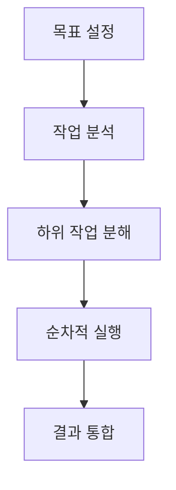

## AI Agent란 무엇인가?

AI Agent는 인공지능 시스템이 단순한 응답이나 작업 수행을 넘어서, 주어진 목표를 달성하기 위해 자율적으로 판단하고 행동하는 새로운 패러다임입니다. 기존의 AI 모델들이 입력에 대한 단순 출력을 제공했다면, AI Agent는 다음과 같은 특징을 가집니다:

1. **자율성(Autonomy)**: 스스로 판단하고 행동할 수 있는 능력
2. **목표 지향성**: 주어진 목표를 달성하기 위한 계획 수립과 실행
3. **작업 분해 능력**: 복잡한 작업을 하위 작업으로 분해하여 순차적 실행

## AI Agent의 핵심 특징

### 1. 자율적 의사결정

AI Agent는 사용자가 설정한 목표를 달성하기 위해 자율적으로 의사결정을 수행합니다. 이는 자율주행 자동차의 레벨 시스템과 유사한 방식으로 이해할 수 있습니다. 각 Agent는 자신의 권한과 능력 범위 내에서 최적의 결정을 내립니다.

### 2. 작업 분해와 실행

복잡한 작업을 작은 단위로 분해하고, 각 단위 작업을 순차적으로 실행하는 능력을 가집니다. 이는 다음과 같은 프로세스로 이루어집니다:

### 3. 도구 활용 능력

AI Agent는 다양한 도구와 API를 활용하여 작업을 수행할 수 있습니다:
- API 호출
- 웹 브라우징
- 데이터 분석
- 외부 서비스 연동

## 실제 활용 사례: 여행 계획 Assistant

AI Agent의 실제 활용 사례를 여행 계획 수립 과정을 통해 살펴보겠습니다.

### 시나리오: 3박 4일 여행 계획 수립

1. **정보 수집 단계**
   - 날씨 API를 통한 목적지 날씨 확인
   - 여행 시기에 적합한 지역 추천

2. **예약 및 일정 조정**
   - 예산에 맞는 호텔 검색 및 예약
   - 관광 명소 입장권 예약
   - 식당 예약 및 추천

3. **최적화 및 조정**
   - 이동 시간을 고려한 일정 최적화
   - 예상치 못한 상황에 대한 대체 계획 수립

## AI Agent의 발전 방향

현재 AI Agent 기술은 RAG(Retrieval-Augmented Generation)에서 더 발전된 형태로 진화하고 있습니다. 앞으로의 발전 방향은 다음과 같습니다:

1. **더 높은 수준의 자율성**
   - 복잡한 의사결정 능력 향상
   - 상황에 따른 유연한 대응

2. **도구 활용의 고도화**
   - 더 다양한 외부 서비스와의 연동
   - 실시간 정보 처리 및 활용

3. **사용자 맞춤형 서비스**
   - 개인화된 선호도 학습
   - 상황 인식 기반 의사결정

## 결론

AI Agent는 인공지능이 단순한 작업 수행을 넘어 자율적인 의사결정과 행동을 할 수 있는 새로운 패러다임을 제시합니다. 이는 다양한 산업 분야에서 혁신적인 서비스와 솔루션을 가능하게 할 것으로 기대됩니다.

앞으로 AI Agent 기술이 발전함에 따라, 우리의 일상생활과 업무 환경에서 더욱 유용한 도구로 자리잡을 것입니다. 이러한 변화에 대비하여 AI Agent의 특성을 이해하고 활용 방안을 모색하는 것이 중요할 것입니다.